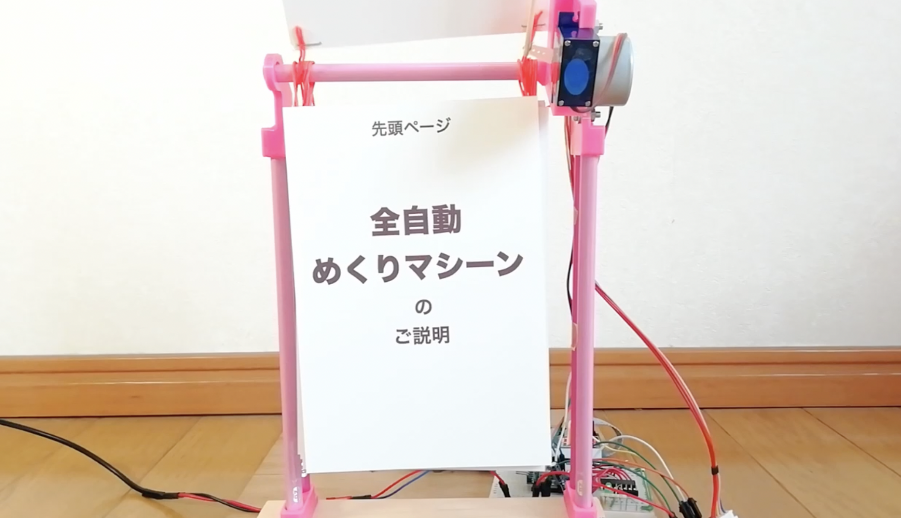

# 全自動めくりマシーン

## これはなに？
全自動で紙をめくることができるマシーンです。  
大量の写真。  
大量の掲示物。  
オタク部屋の大量萌えポスター。  
困ってませんか？  
コンパクトに収めつつ全て見続けることができるマシーンを目指してます。  
  
...といっても現状では6枚くらいしかセットできません。  
  
[https://youtu.be/qkBNIvQqPG4](https://youtu.be/qkBNIvQqPG4)

## 構成
+ 制御：Arduino
+ 電源：USB 5V
+ ステッピングモータ
+ 9gサーボ
+ 3Dプリンタ(PLA)＋鉛筆

## 販売してる？
まだ販売はしていません。  
音がうるさいのをなんとかしたら、キット販売したいです。  
予想売値は5000円程度と思います。  

## 苦労した点
10年くらいちょっとずつ研究してます。  
作っててわかったのですが、紙をめくるというのは難しいです。  
めくり失敗しやすいです。  

