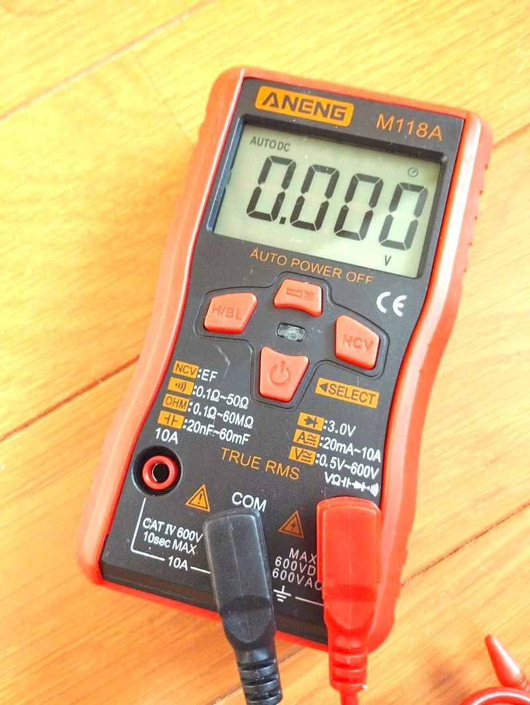

# ANENG M118A マニュアル日本語訳

このテスター買うと英語説明書 User manual が付いていますが、
文字が小さいし長いので翻訳サービス通してみました。

## 翻訳
<pre><code>
自動スキャンデジタル・マルチメーター
ユーザーマニュアル

1、概要
このシリーズのマルチメーターは、ポケットサイズの3 5/6ビットの実効値自動スキャンデジタルメーターです。入力電圧/電流/抵抗/同位信号に応じて、本器は自動的に測定モードを識別します。本シリーズの製品は、安定した性能、高い精度、明瞭な読み取り値が特徴です。フラッシュライトと非接触電圧テストの便利な機能も備えており、工場、教育機関、電子機器愛好家に最適な製品です。

2、安全に関する注意事項 
本シリーズの製品は、IEC1010規定(国際電気標準会議が発行した安全基準)に従って設計されています。使用前に安全上の注意をよくお読みください。安全規定を厳守し、人身事故や機器の損傷を防いでください。

1、電圧測定時、有効値で直流600VまたはAC600Vを超える制限電圧を入力しないでください。
2、36V以下は安全電圧です。36Vを超える電圧を測定する際は、安全に十分注意してください。36Vを超える電圧は人体に危害を及ぼす可能性があります。

3、 機能やレンジを変更する際は、テストリードを測定ポイントから離してください。
4、正しい機能とレンジを選択してください。誤った操作は避けてください。本シリーズの製品はフルレンジ保護機能を備えていますが、安全のため、より一層注意を払ってください。
5、安全記号は、「危険電圧の存在」「アース」「二重絶縁」「作業者は取扱説明書を参照する必要がある」「低電圧記号」を意味します。

3、特徴
	1、一般特性
		1-1、表示方式: LCD
		1-2、最大表示値: 5999(3 5/6ビット自動表示)  
		1-3、測定方式: 二重積分型A/D変換
		1-4、サンプリングレート: 約3回/秒
		1-5、オーバーレンジ表示: "OL"表示
		1-6、低電圧表示: バッテリー残量が少なくなると"バッテリー"マークが表示される
		1-7、動作環境: (0~40)℃、相対湿度<80%
		1-8、電源: 単3電池2本(1.5V x 2)
		1-9、外形寸法: 118 x 68 x 30mm
		1-10、重量: 電池を除いて約100g
	2、技術的特性
		精度: ±(読み取り値の%+最小有効桁)、保証精度環境: 温度(23±5)℃、相対湿度<75%、校正保証期間1年。
		2-2、性能 (「▲」はその機能があることを示す)
		
		機能
		直流電圧測定▲ 
		交流電圧測定▲
		直流電流測定▲
		交流電流測定▲ 
		抵抗/ダイオード/導通テスト▲
		コンデンサ容量測定▲  
		静電容量測定▲ 
		非接触電圧(NCV)検出▲
		ゼロライン/火災線テスト▲
		フル単位表示▲
		バックライト点灯 ▲
		自動電源オフ▲
		実効値AC測定▲
		フラッシュライト点灯▲

	3-1、直流/交流電圧測定(DCV/ACV)
		レンジ  精度  分解能
		直流/交流 6V ±(0.5%+3)  0.001V
		直流/交流 60V    0.01V
		直流/交流 600V   0.1V 
		入力インピーダンス: 10MΩ、オーバーロード保護: 直流600Vまたは交流600Vピーク値
	
	3-2、抵抗測定(Ω)  
		レンジ  精度   分解能
		600Ω  ±(0.8%+5)   0.1Ω
		6kΩ ±(0.8%+3)   1Ω
		60kΩ     10Ω
		600kΩ     100Ω
		6MΩ   1kΩ
		60MΩ  ±(2.5%+3)  10kΩ
		入力インピーダンス: 10MΩ、オーバーロード保護: 直流600Vまたは交流600Vピーク値
	
	3-3、ダイオード/導通テスト
		レンジ  表示値   テスト条件
		---  ダイオード正方向降下電圧  正方向電流約1mA   
		   端子間電圧約3V 
		   ブザーが長音を鳴らし、両端子間抵抗が(50±20)Ω未満の場合  
		   開放電圧約0.4V
		入力インピーダンス: 10MΩ、オーバーロード保護: 直流600Vまたは交流600Vピーク値  
	
	3-4、コンデンサ容量測定(C) (JS33Dモデルのみ)
		レンジ  精度   分解能  
		10nF  ±(3.5%+20)   100pF
		100nF    100pF
		1uF    1nF
		10uF    10nF
		100uF    100nF
		1mF    1uF
		10mF    10uF
		60mF  ±(5%+3)   100uF
		オーバーロード保護: 直流600Vまたは交流600Vピーク値
	
	3-5、交流/直流電流(AC/DC A)  
		レンジ  精度   分解能
		6A  ±(2%+30)   0.001A
		10A    0.01A  
		最大測定電圧降下: 600mV、オーバーロード保護: 10A

4、操作キーの説明
	1、フラッシュライトトリガーボタン
	2、NCVキー(非接触電圧測定)、長押しでNCV電界誘導信号測定
	3、H/BLキー(データホールド/バックライト)、2秒長押しでLCDバックライトを点灯、約15秒後に自動消灯 
	4、電源キー、2秒長押しで電源オン/オフ、起動時はこのキーで機能を切り替え

5、操作ガイダンス  
	5-1、直流/交流電圧自動スキャンテスト(DCV/ACV)
		1.電源キーを2秒以上長押しして本体の電源をオンにします。起動時に"AUTO"と表示されます。
		2.黒色プローブを"COM"ジャックに、赤色プローブを"V/Ω"ジャックに確実に接続し、テスト対象に接触させます。
		3."COM"と"V/Ω"の入力端子間の電圧が0.5V以上の場合、本器は直流・交流成分の大きさを比較し、大きい方の成分の信号を取り、測定値に応じて自動的にレンジを切り替えた後、LCDに測定値を表示します。
		4.ノイズ環境下で測定できない場合は、電源キーを押して手動で直流または交流電圧測定モードを選択し測定を行ってください。

		注意:
		1、入力電圧は直流600VまたはAC600Vを超えないようにしてください。超えると機器回路が損傷する恐れがあります。36V以上の電圧を測定する際は感電の危険に特に注意が必要です。
		2、全ての測定が終了したら、本体プローブを測定対象回路から必ず外してください。

	5-2、抵抗測定
		1.電源キーを2秒以上長押しして本体の電源をオンにします。起動時に"AUTO"と表示されます。  
		2.黒色プローブを"COM"ジャックに、赤色プローブを"V/Ω"ジャックに確実に接続し、テスト対象に接触させます。
		3.プローブ両端の抵抗値が50Ω未満の場合、ブザーが連続音を鳴らします。このとき電源キーを押して手動で導通テスト機能を選択してください。
		4.閉回路の抵抗を測定する場合、事前に測定対象の放電処理を行わないと、回路内の電圧が0.6V以上あれば本器は誤って電圧測定モードに入ってしまいます。
		5.赤黒プローブ間の抵抗が50Ω超の場合、本器は実際の抵抗値に応じて自動的にレンジを切り替え、その後LCDに測定値を表示します。
		
		注意: 
		1、低抵抗を測定する際、正確な読み取り値を得るために、あらかじめプローブ短絡時の値を記録し、実測値からその値を差し引いてください。
		2、活線抵抗を測定する際は、回路の電源をすべて切り、コンデンサの放電を行って、測定値の正確性を確保してください。
	
	5-3、ダイオード測定
		1.電源キーを2秒以上長押しして本体の電源をオンにします。起動時に"AUTO"と表示されますので、電源キーを押してダイオード測定機能を手動で選択します。
		2.黒色プローブを"COM"ジャックに、赤色プローブを"V/Ω"ジャックに確実に接続し、テスト対象に接触させます。  
		3.本器のLCDには、測定したダイオードの正方向降下電圧が表示されます。ダイオードの極性がプローブ接続と逆の場合、または開放状態の場合は"OL"と表示されます。
		
	5-4、コンデンサ容量測定  
		1.電源キーを2秒以上長押しして本体の電源をオンにします。起動時に"AUTO"と表示されますので、電源キーを押して手動でコンデンサ容量測定機能を選択します。
		2.黒色プローブを"COM"ジャックに、赤色プローブを"V/Ω"ジャックに確実に接続し、テスト対象に接触させます。
		3.本器は赤黒プローブ間のコンデンサ容量値に応じて自動的にレンジを切り替え、LCDに測定したコンデンサの容量値を表示します。コンデンサ容量の測定範囲は10nF/100nF/1uF/10uF/100uF/1mF/10mF/60mFです。
		
		注意:
		1、コンデンサ容量を測定する前に、必ず測定対象のコンデンサを完全に放電してください。放電していないと電圧測定モードに入ってしまいます。
		2、10nFレンジでコンデンサ容量を測定する際、LCDに若干の残留読み取り値が表示される場合があります。これは本体プローブの分布容量によるものです。正確な読み取り値を得るには、この値を測定値から差し引いてください。
		3、大容量コンデンサでリーク、破損が発生した場合、LCDには不安定な値が表示されます。大容量コンデンサを測定する際、読み取り値が安定するまでに数秒かかりますが、これは正常な動作です。  
		4、単位の換算は以下の通りです。1F=1000mF  1mF=1000uF  1uF=1000nF  1nF=1000pF
		
	5-5、電流測定機能(DC/AC A)  
		1.電源キーを2秒以上長押しして本体の電源をオンにします。起動時に"AUTO"と表示されます。
		2.黒色プローブを"COM"ジャックに、赤色プローブを"10A"ジャックに確実に接続し、テスト対象に接触させます。  
		3."COM"と"10A"入力端子間の電流が20mA以上の場合、本器はAC/DC成分の大きさに応じて、大きな直流成分値を液晶に表示します。
	
		注意:
		1.本器を測定対象回路に直列に接続する前に、その回路の電源を必ず切ってください。
		2.最大入力電流は10A(赤プローブの挿入位置による)です。過電流が流れるとヒューズが切れる恐れがあるので注意が必要です。また、1回の測定時間は10秒以内としてください。過電流や長時間の測定で本体が過熱し、故障の原因になります。  
		3.赤プローブを"10A"ポートに挿入した状態で、本体プローブテストピンを並列に回路に接続しないでください。ヒューズが切れたり、本体が損傷する恐れがあります。
		4.全ての測定が終了したら、まず電源を切り、次に本体プローブと測定対象回路の接続を外してください。  
		5."10A"ポートと"COM"ポート間に直流36V以上または交流25V以上の電圧を加えないでください。
		
	5-5、NCV(非接触電圧)測定
		1. 電源キーを2秒以上長押しして本体の電源をオンにします。'NCV'キーを押してEF(電界)測定モードに入り、そのキーを長押ししたままにします。
		2. 本器にはNCV検知用のインダクションエンドがあり、このエンドを交流電圧の近くに近づけると、信号強度に応じてブザーが異なる周波数の連続音を鳴らします。同時にLCDにも信号強度に応じて異なるセグメントが表示されます。

6. 自動電源オフ機能
	本器には自動電源オフ機能があり、15分間操作がない状態が続くと自動的に電源がオフになり、スリープ状態に入ります。再度使用する際は、電源キーを2秒以上長押しすると、本体が復帰し自動スキャン測定状態("AUTO"表示)になります。自動電源オフ機能をキャンセルしたい場合は、スリープ状態のときに"HOLD"キーと電源キーを同時に押すと、本器が起動し、自動電源オフ機能がキャンセルされます。
</code></pre>

## 所感 / レビュー
中華通販購入時価格 ¥900

### 電圧精度
校正してあるマルチメーターで電圧測定しましたが 0.01mV あたりの誤差は +-0.08mV もあり、あまり信用できないです。  
デジタル系電子工作には問題ないですが、センサー測定など精密用途には向きません。  
分解して電圧調整ネジ探しましたが、ありませんでした。昔のテスターには普通にあったのに。残念。

### 電池
弱っているマンガン電池でも動きました  
マンガン電池は液漏れしにくいので長期間工具箱に放り込んでおいても安心です。

### 大きさ
思ってたより小さくて良いです。  
赤いカバーは柔らかいゴム製で外すことができます。  
外すともっと小さくなります。

2024/04/20
