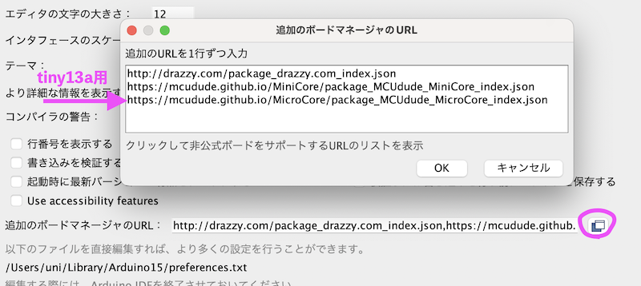
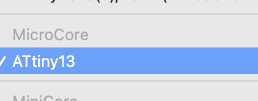
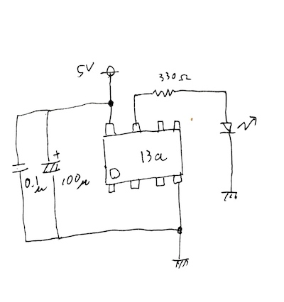
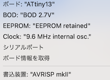
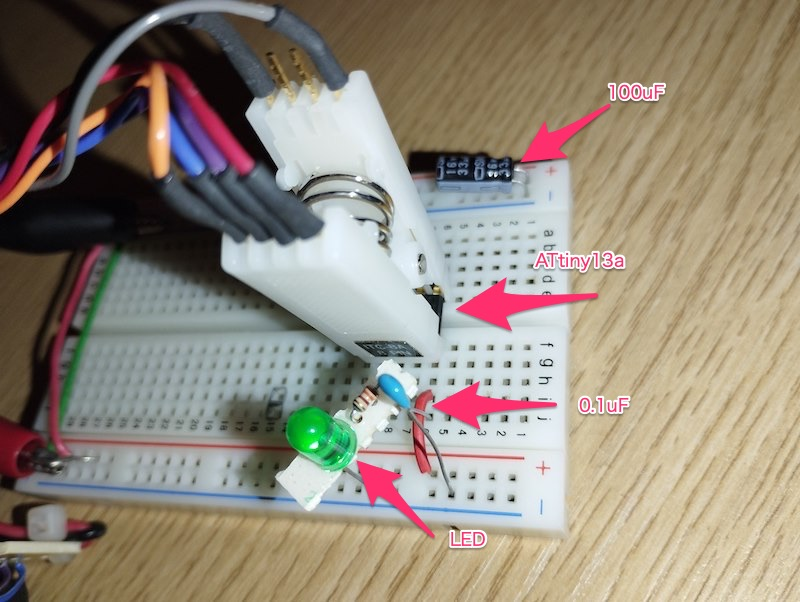

# M1 Mac で ATtiny13a を使う

2023/03/19

M1 Mac こと Apple silicon のMacでAVRの書き込みができないかなあ？と調べた結果  
上手くいきました。  
LED点滅(Lチカ)を目標にします。

言語 : Arduino  
対象マイコン : ATtiny13a  
書き込み装置 : AVRISPmkII  

## 環境設定

ATtinyシリーズ用ライブラリは ATTinyCore が有名だけど ATTinyCore では13aサポートされてない。  
似たようなもので MicroCore が必要  
[GitHub - MCUdude/MicroCore: A light-weight Arduino hardware package for ATtiny13](https://github.com/MCUdude/MicroCore/)  
インストール方法に従いボードマネージャに追加する。  

  

選べるようになってる  
  

## 回路図

## コード
<pre>
<code>
void setup() {
  pinMode(2, OUTPUT);
}

void loop() {
  digitalWrite(2, HIGH);
  delay(500);
  digitalWrite(2, LOW); 
  delay(500);
}
</code></pre>

## 書き込み設定

秋月で買ったDIP-IC用クリップ使って書き込んでる。便利。  

ISP繋げっぱなしのためには、パスコン100uFが必要だった。  
つけないと高速点灯してしまう（バグってる感じ）
