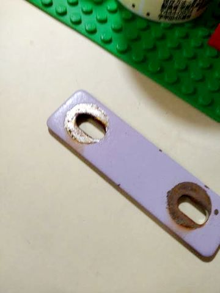
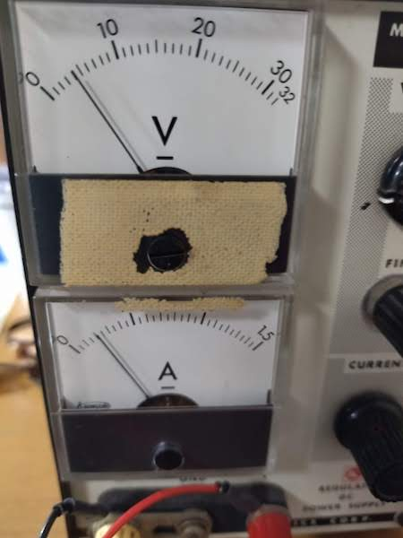
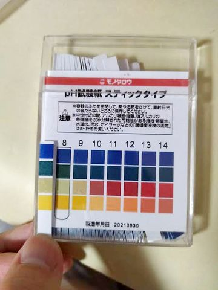
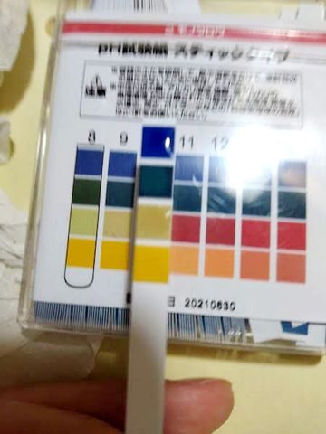

# 電気分解でアクリル塗装剥がし。失敗

電気分解で**ラッカー塗料**のアクリル塗膜剥がしできないかやってみた。樹脂は半透膜のこともあるため期待してみて。

結果、全然ダメ。  
陰極でも陽極でも剥がせない。  
錆(サビ)は面白いくらいに落とせた。  
<video controls playsinline muted autoplay src="acry_paint.mov"></video>  

処理対象はアクリル塗装付きの鉄板。  

陽極は中華製炭素電極。  
電解液は沸騰させた重曹水。  
電流は0.25Aくらいからガツガツ泡が出る。  
  

300クーロンほどしか流しないと思うが、phは予想通り上がった  
  

他の塗装試してみた。  
紙を束ねる用の黒クリップだと、モクモクと反応して塗装が劣化してくる。  
黒塗装ではなくて、黒染め皮膜なのかも？  
<video controls playsinline muted autoplay src="iron_crip.mov"></video>

ちなみに、アクリル塗料でも**水性**塗料はマジックリンで簡単に洗い落とすことができる。  
電気分解使うまでも無いくらいサクサク落ちるので驚いた。  
こんなに弱いと、屋外で水性塗料使うの躊躇する。

**ラッカー塗料**はマジックリンでは全然洗い落とせなかった。シンナー使わないと落ちない。  

2022/6/23
